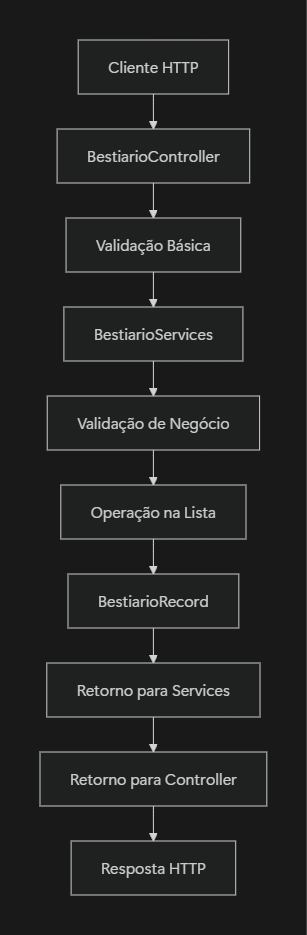

# Documentação REST API | Bestiário

A **API** desenvolvida no **exercício 1** é um sistema de **Bestiário de criaturas** com ações completas de CRUD *(Create, Read, Update e Delete)* assim como funcionalidades de filtro e listagem. A arquitetura segue o padrão **MVC** *(Model-View-Controller)*, com uma camada de serviços para lógica de negócio.

## Estrutura do Projeto

### Arquitetura Utilizada

```
┌────────────────────┐
│     Controller     │  ← Camada de Apresentação (Endpoints da API)
│ (Requisições HTTP) │
└─────────┬──────────┘
          │
          ▼
┌─────────────────────┐
│      Services       │  ← Camada de Lógica de Negócio
│ (Lógica de Negócio) │
└─────────┬───────────┘
          │
          ▼
┌───────────────────┐
│       Model       │  ← Camada de Dados (Entidades e Enums)
│ (Modelo de Dados) │
└───────────────────┘
```

## Componentes Detalhados

### 1. Program.cs - Configuração da Aplicação

**Propósito**: Configuração da injeção de dependência da aplicação.

```csharp
builder.Services.AddSingleton<BestiarioServices>();
```

**Explicação**:

- Registra `BestiarioServices` como **Singleton** no container de DI
- Significa que a **mesma instância** será reutilizada em todas as requisições
- Mantém os dados em memória durante toda a execução da aplicação
- Ideal para dados que não precisam persistir em banco de dados

### 2. BestiarioController - Camada de Apresentação

**Responsabilidades**:

- Receber requisições HTTP
- Validar entrada básica
- Chamar métodos da camada de serviços
- Retornar respostas HTTP apropriadas
- Tratamento de exceções

### Estrutura do Controller

```csharp
[ApiController]
[Route("api/bestiario")]
public class BestiarioController : Controller
```

**Atributos**:

- `[ApiController]`: Habilita recursos específicos para APIs (validação automática, binding de modelos)
- `[Route("api/bestiario")]`: Define a rota base para todos os endpoints

### Injeção de Dependência

```csharp
public BestiarioController(BestiarioServices services)
{
    _services = services;
}
```

**Como funciona**:

1. O ASP.NET Core injeta automaticamente a instância de `BestiarioServices`
2. A mesma instância é reutilizada *(Singleton)*
3. O controller acessa os serviços através da propriedade `_services`

### Endpoints Disponíveis

| **Método** | **Rota** | **Propósito** | **Parâmetros** |
| --- | --- | --- | --- |
| GET | `/api/bestiario` | Listar todas as criaturas | Nenhum |
| GET | `/api/bestiario/{id}` | Buscar criatura por ID | `id` (int) |
| GET | `/api/bestiario/criaturas` | Filtrar criaturas | Query parameters opcionais |
| POST | `/api/bestiario` | Criar nova criatura | JSON no body |
| PUT | `/api/bestiario` | Atualizar criatura existente | JSON no body |
| DELETE | `/api/bestiario/{id}` | Excluir criatura | `id` (int) |

### Tratamento de Exceções

Todos os endpoints seguem o mesmo padrão de tratamento:

```csharp
try
{
    *// Lógica do endpoint*
    return Ok(result);
}
catch (KeyNotFoundException ex)
{
    return NotFound(ex.Message);          *// 404*
}
catch (ArgumentException ex)
{
    return BadRequest(ex.Message);        *// 400*
}
catch (Exception ex)
{
    return StatusCode(500, $"Erro interno do servidor: {ex.Message}"); *// 500*
}
```

### 3. BestiarioServices - Camada de Lógica de Negócio

**Responsabilidades**:

- Gerenciar a lista de criaturas em memória
- Implementar regras de negócio
- Validar dados de entrada
- Executar operações CRUD

### Armazenamento de Dados

```csharp
private readonly List<BestiarioRecord> _criaturas;
```

**Características**:

- Lista privada e readonly (referência imutável)
- Inicializada no construtor com dados de teste
- Mantém estado durante toda execução da aplicação
- Simula um banco de dados em memória

### Métodos Privados

### ValidateParams()

**Propósito**: Centralizar todas as validações de dados

**Parâmetros**:

- `record`: Objeto a ser validado
- `isUpdate`: Flag para distinguir validações de criação vs atualização

**Validações implementadas**:

- Campos obrigatórios (Nome, Nível, Dano, Defesa)
- Valores mínimos (números não negativos)
- Validação de enums
- Regras específicas para criação/atualização

### GetHighestID()

**Propósito**: Gerar IDs sequenciais automaticamente

**Funcionamento**:

```csharp
{
	BestiarioRecord record = _criaturas.MaxBy(e => e.Id);
	return record.Id;
}
```

### Métodos Públicos (API da Camada de Serviço)

### GetList()

- **Retorna**: Lista completa de criaturas
- **Uso**: Endpoint GET `/api/bestiario`

### Get(int id)

- **Parâmetros**: ID da criatura
- **Retorna**: Criatura específica ou exceção se não encontrada
- **Uso**: Endpoint GET `/api/bestiario/{id}`

### GetFilter()

- **Parâmetros**: Filtros opcionais (nome, nível, tipo, etc.)
- **Retorna**: Lista filtrada de criaturas
- **Funcionamento**: Utiliza LINQ com operadores condicionais
- **Uso**: Endpoint GET `/api/bestiario/criaturas`

```csharp
var records = _criaturas.Where(e => nome != null ? e.Nome.Contains(nome) : true)
                        .Where(e => nivel != null ? e.Nivel == nivel : true)
                        *// ... outros filtros*
```

### Create()

- **Parâmetros**: Nova criatura
- **Funcionamento**:
    1. Valida dados de entrada
    2. Gera ID automático se não informado
    3. Verifica duplicidade de ID
    4. Adiciona à lista

### Update()

- **Parâmetros**: Criatura com dados atualizados
- **Funcionamento**:
    1. Valida dados de entrada
    2. Localiza registro existente por ID
    3. Preserva dados originais necessários (ex: data de registro)
    4. Substitui o registro na lista

### Delete()

- **Parâmetros**: ID da criatura
- **Funcionamento**:
    1. Localiza registro por ID
    2. Remove da lista
    3. Retorna exceção se não encontrado

### 4. Model - Camada de Dados

### BestiarioRecord (Entidade Principal)

**Propriedades**:

| **Propriedade** | **Tipo** | **Obrigatório** | **Propósito** |
| --- | --- | --- | --- |
| **Id** | `int` | Sim | Identificador único |
| **Nome** | `string` | Sim | Nome da criatura |
| **Descricao** | `stirng?` | Não | Descrição detalhada |
| **HP** | `int` | Sim | Pontos de vida |
| **Nivel** | `int` | Sim | Nível da criatura |
| **NivelPerigo** | `NivelPerigo` | Sim | Enum de perigo |
| **Raridade** | `Raridade` | Sim | Enum de raridade |
| **Dano** | `int` | Sim | Poder de ataque |
| **Defesa** | `int` | Sim | Poder defensivo |
| **DtRegistro** | `DateTime?` | Não | Data de cadastro |
| **Tipo** | `Tipo` | Sim | Enum de tipo da criatura |

**Construtor Padrão**:

```csharp
public BestiarioRecord()
{
    *// Define valores padrão para todos os campos*
    Id = 0;
    Nome = "";
    HP = 1;
    Nivel = 1;
    *// ... outros campos*
}
```

### Enums do Sistema

### NivelPerigo

```csharp
public enum NivelPerigo {
	NENHUM = 0    *// Criatura inofensiva*
	BAIXO = 1     *// Pouco perigosa*
	MEDIO = 2     *// Moderadamente perigosa*
	ALTO = 3      *// Muito perigosa*
	EXTREMO = 4   *// Extremamente perigosa*
	FUJA = 5      *// Fuja imediatamente!*
}
```

### Raridade

```csharp
public enum Raridade {
	COMUM = 1     *// Facilmente encontrada*
	INCOMUM = 2   *// Pouco comum*
	RARO = 3      *// Difícil de encontrar*
	LENDARIO = 4  *// Extremamente rara*
	ICONICO = 5   *// Única/Mítica*
}
```

### Tipo

```csharp
public enum Tipo {
	HUMANO = 1      *// Humanos e humanoides*
	MORTO_VIVO = 2  *// Zumbis, esqueletos, etc.*
	SELVAGEM = 3    *// Animais selvagens*
	GIGANTE = 4     *// Criaturas gigantescas*
	ABERRACAO = 5   *// Criaturas anômalas*
	INSETO = 6      *// Insetos e aracnídeos*
	CONSTRUTO = 7   *// Golens, robôs, etc.*
}
```

## Fluxo de Dados e Conexões

### Fluxo de uma Requisição Típica



### Exemplo Prático: Criar Nova Criatura

1. **Cliente** envia POST `/api/bestiario` com JSON
2. **Controller** recebe e chama `_services.Create(record)`
3. **Services** executa `ValidateParams(record, false)`
4. **Services** gera novo ID com `GetHighestID() + 1`
5. **Services** verifica se ID já existe na lista
6. **Services** adiciona novo `BestiarioRecord` à lista
7. **Controller** retorna HTTP 201 Created

### Injeção de Dependência - Como Funciona


**Benefícios desta arquitetura**:

- **Desacoplamento**: Controller não conhece implementação dos services
- **Testabilidade**: Fácil de mockar services para testes
- **Manutenibilidade**: Mudanças nos services não afetam controller
- **Reutilização**: Mesma instância de services para todas as requisições

## Características Técnicas

### Gerenciamento de Estado

- **Singleton Pattern**: Uma única instância de `BestiarioServices`
- **Estado em Memória**: Dados não persistem após reinicialização
- **Thread Safety**: Pode requerer atenção em ambiente de alta concorrência

### Tratamento de Erros

- **Exceções Tipadas**: `KeyNotFoundException`, `ArgumentException`
- **HTTP Status Codes**: 200, 201, 400, 404, 500
- **Mensagens Descritivas**: Erros retornam mensagens em português

### Validações Implementadas

- **Campos Obrigatórios**: Nome, HP, Nível, etc.
- **Tipos de Dados**: Validação de enums
- **Regras de Negócio**: IDs únicos, datas válidas
- **Valores Mínimos**: Números não podem ser negativos

## Pontos de Melhoria para Produção

1. **Persistência**: Implementar banco de dados real
2. **Logging**: Adicionar logs estruturados
3. **Autenticação**: Implementar JWT/OAuth
4. **Validações**: Usar FluentValidation ou DataAnnotations
5. **Documentação**: Adicionar Swagger/OpenAPI
6. **Testes**: Implementar testes unitários e de integração
7. **Thread Safety**: Considerar ConcurrentCollection para alta concorrência

## Uso da API

### Exemplos de Requisições

### Listar todas as criaturas

`GET /api/bestiario`

### Buscar criatura por ID

`GET /api/bestiario/1`

### Filtrar criaturas

`GET /api/bestiario/criaturas?nome=Dragão&nivel=10&tipo=4`

### Criar nova criatura

```json
**POST** /api/bestiario
Content-Type: application/json

{
    "nome": "Dragão Vermelho",
    "descricao": "Um dragão ancestral",
    "hp": 500,
    "nivel": 20,
    "nivelPerigo": 5,
    "raridade": 4,
    "dano": 100,
    "defesa": 80,
    "dtRegistro": "2024-01-01T00:00:00",
    "tipo": 4
}
```